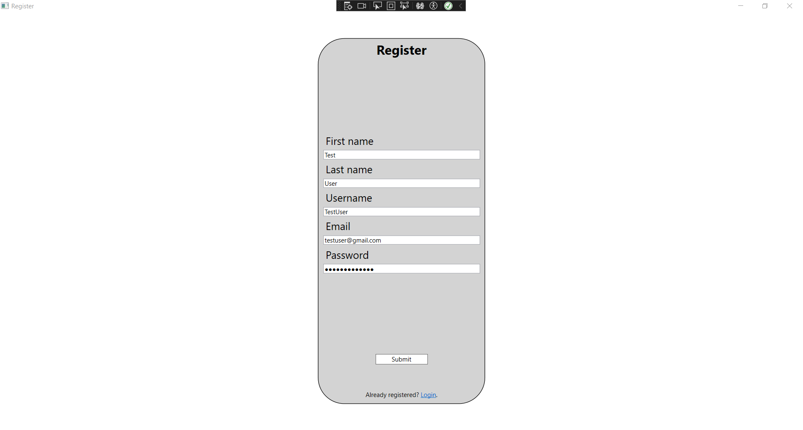
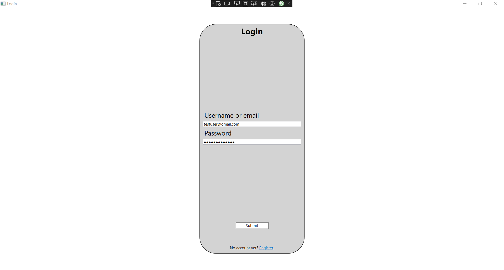
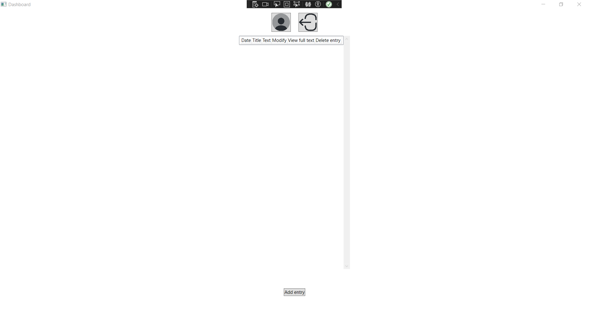
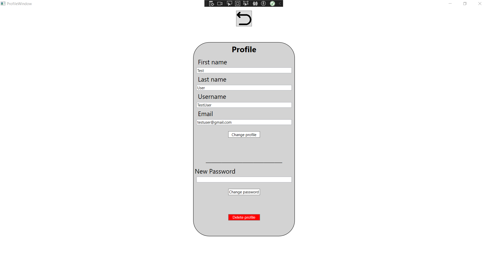
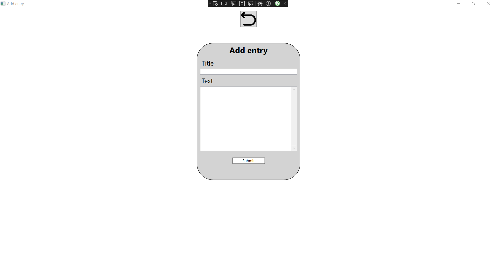
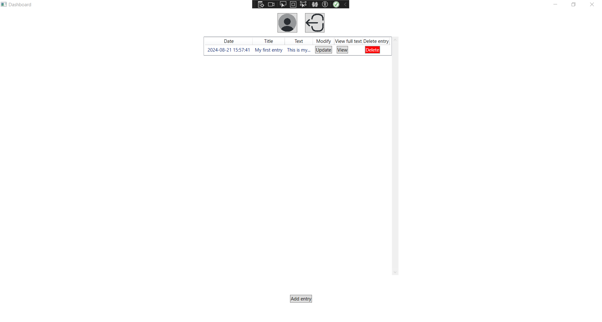
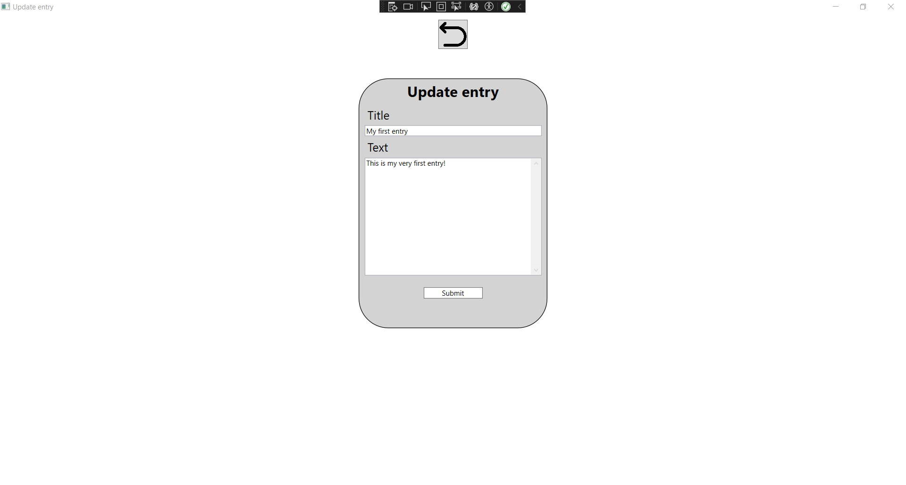
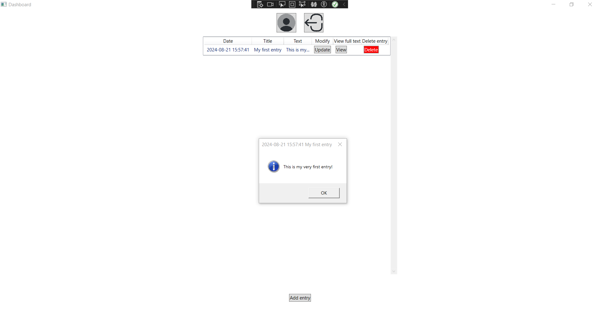

# entries_manager
Simple entries manager using a classic client-server architecture.
The user can enter a simple diary entry containing title and text message.
This project demonstrates my skills in desktop development (WPF/.NET), backend development (Express in Node.js)
and database development (Microsoft SQL Server/T-SQL).
This project also uses dependency injection in the desktop application using the Ninject library (NuGet package).
Refer to [the screenshot guide](#screenshot-guide) for more information.

## Used technologies
  
   
 

* **Frontend:** WPF (C#)  
* **Backend:** Express in Node.js  
* **Database:** Microsoft SQL Server  

## Screenshot guide
Prerequisites: 
* Create a Microsoft SQL Server (either standalone or Docker)
* Create a new database called EntriesManager
* Execute the database [script](Database/sql-script-1.sql)
* Start the [backend](Backend) application (configure all necessary information [here](Backend/config))
* Start the [desktop](WPF_Frontend) application (configure all necessary information [here](WPF_Frontend/WPF_Frontend/Config))
 
**Step 1**: Register if you have no account.
 

 
**Step 2**: Log in.
 

 
**Step 3**: You can see the home screen now.
 

 
**Step 4**: The profile icon can be used to modify the profile.
 

 
**Step 5**: The user has to fill in the title and the text message in order to add a new entry.
 

 
**Step 6**: The entry is now ready to be added.
 

 
**Step 7**: The user can see the entry on the home screen now.
 

 
**Step 8**: The user can also update the entry.
 

 
**Step 9**: The whole text of the entry can be displayed using the "View" option (due to the lack of space).
 
